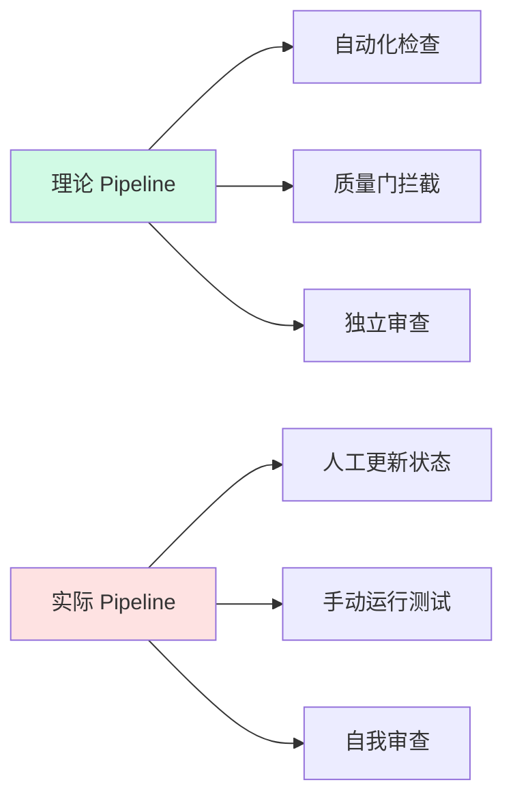
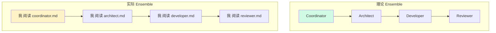
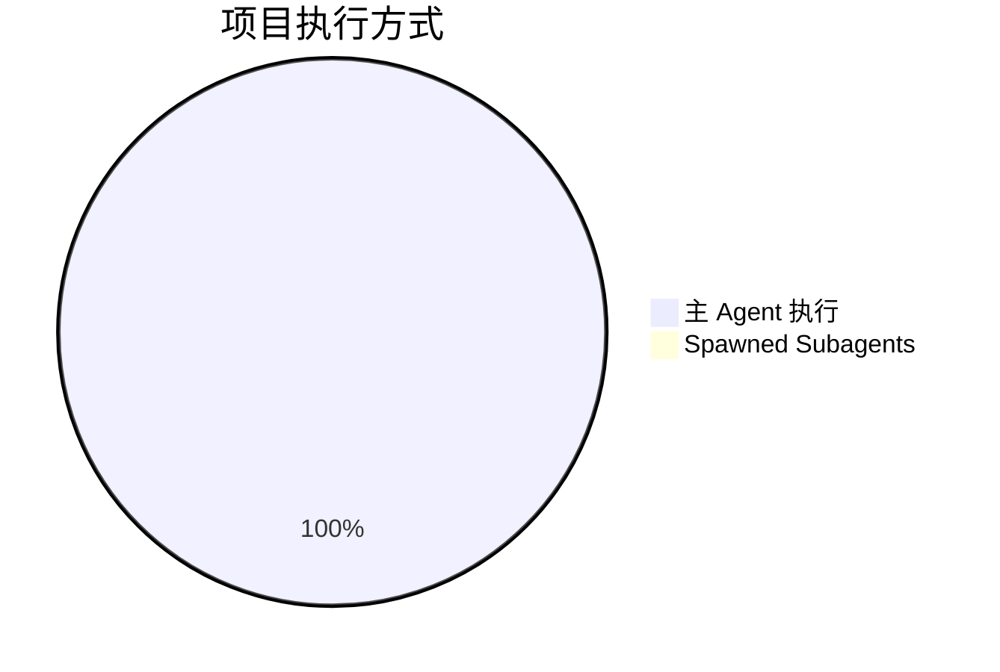
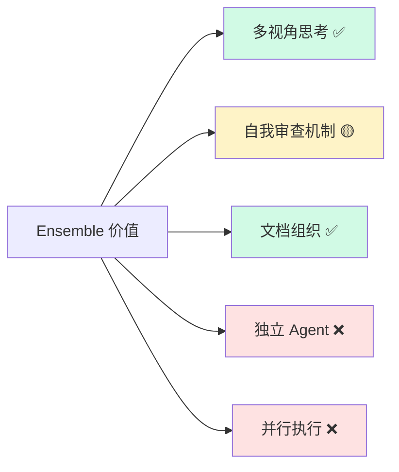
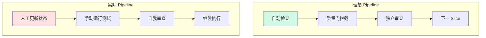
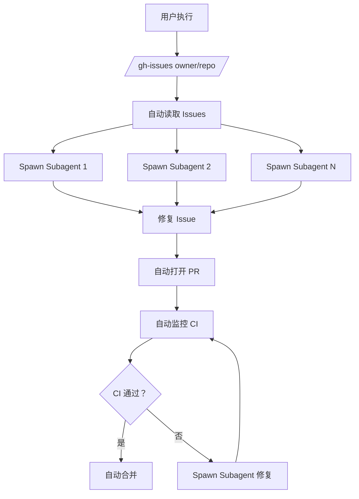
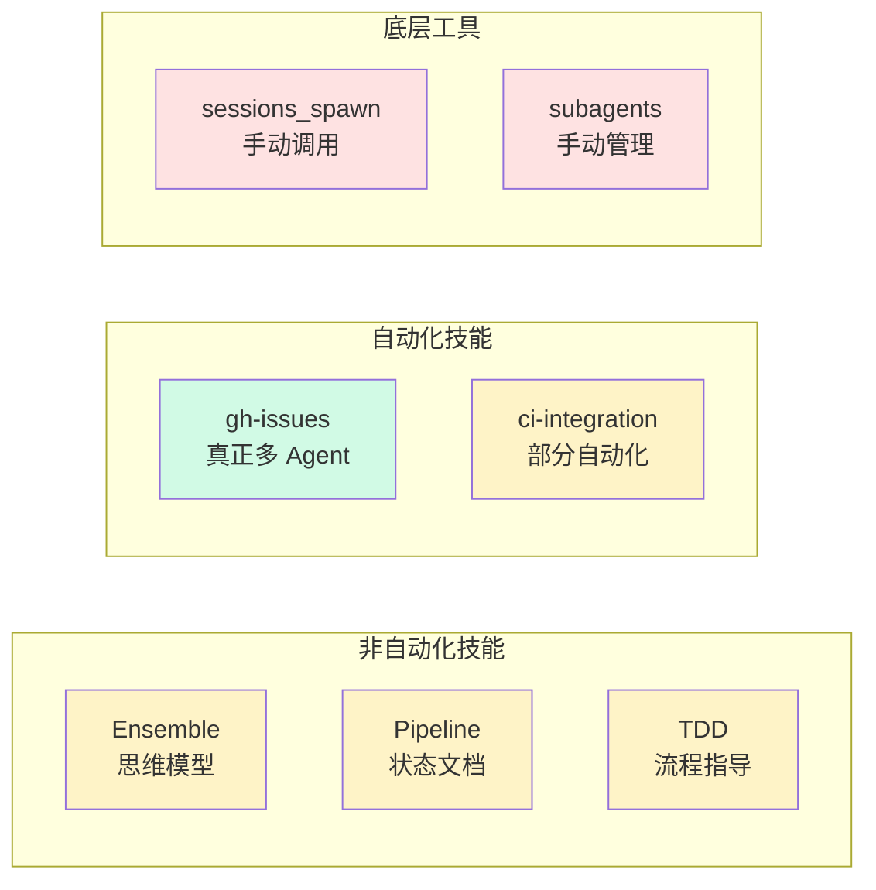
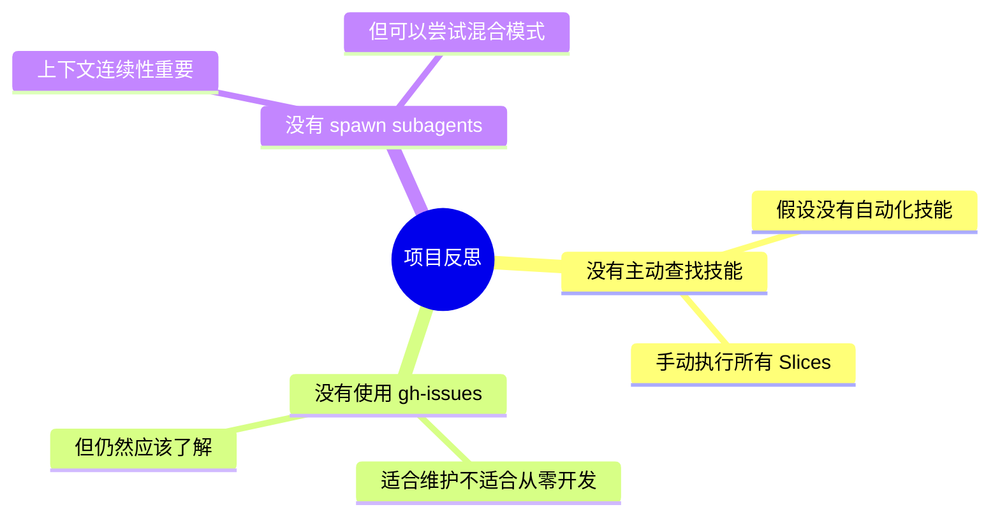
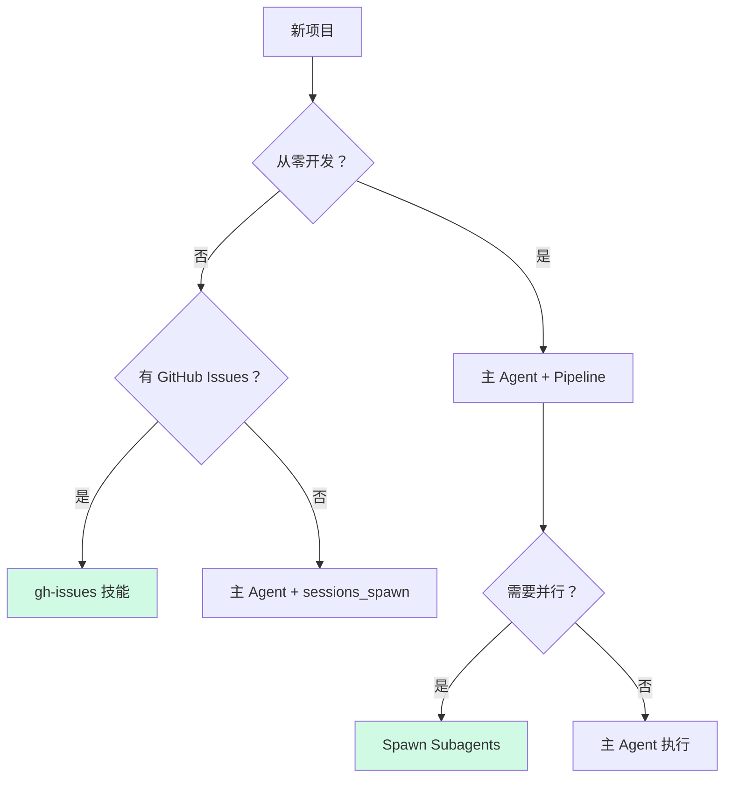
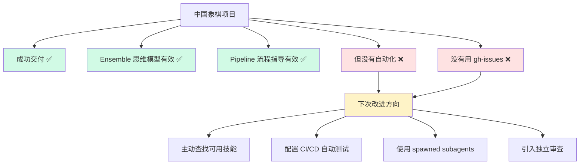

# OpenClaw 多 Agent 与 Pipeline 技能深度解析

> **基于中国象棋项目的实践反思与技能调查**

---

## 📋 目录

- [背景](#背景)
- [核心问题](#核心问题)
- [Ensemble 技能真相](#ensemble-技能真相)
- [Pipeline 技能真相](#pipeline-技能真相)
- [TDD 技能真相](#tdd-技能真相)
- [真正的自动化多 Agent](#真正的自动化多-agent)
- [技能对比总结](#技能对比总结)
- [教训与建议](#教训与建议)

---

## 📖 背景

在**中国象棋 AI 项目**中，我们首次完整使用了 OpenClaw 的 **Ensemble + Pipeline + Factory Mode** 方法：

| 指标 | 数值 |
|------|------|
| 📅 开发时间 | 6 天 |
| 📝 测试用例 | 180 个 |
| 💻 代码行数 | ~8,200 行 |
| 🎯 测试通过率 | 94.4% |
| 🏗️ 开发方法 | Ensemble + Pipeline + TDD |

**项目成功了，但引发了关键问题**：

> "这些技能是真正自动化的多 Agent 系统，还是只是流程指导文档？"

---

## 🎯 核心问题

### 问题 1: Pipeline 如何保障分步执行？

**答案**：**主要靠自律，不是他律**



**实际执行机制**：

```
┌─────────────────────────────────────────────────────────────┐
│ 实际 Pipeline (人工自律)                                    │
├─────────────────────────────────────────────────────────────┤
│ 我 → 读取 SLICE_X.md → 执行 → 自我检查 → 标记完成 → 下一 Slice │
│      ↓          ↓         ↓          ↓                     │
│   状态文件    TDD 循环   运行测试   更新文档                │
└─────────────────────────────────────────────────────────────┘
```

**保障机制**：**我主动遵守流程**，没有外部强制。

---

### 问题 2: Ensemble 的角色分工是如何执行的？

**答案**：**一人分饰多角，不是独立 Agent**



**真相**：`.team/` 目录是**角色帽子**，我一人分饰多角。

```
.team/
├── coordinator.md      ← 文档（不是独立 Agent）
├── architect.md        ← 文档（不是独立 Agent）
├── developer.md        ← 文档（不是独立 Agent）
└── reviewer.md         ← 文档（不是独立 Agent）

使用方式：
我 (主 Agent) 阅读 coordinator.md → 模拟 Coordinator 思维
我 (主 Agent) 阅读 architect.md   → 模拟 Architect 思维
```

---

### 问题 3: Pipeline 执行者是 spawned subagents 吗？

**答案**：**不是，全程主 Agent 一人执行**



**为什么没有用 Subagents**？

| 原因 | 说明 |
|------|------|
| **项目规模适中** | ~8,200 行代码，主 Agent 可承载 |
| **上下文连续性** | 中国象棋规则复杂，频繁切换会丢失上下文 |
| **沟通成本** | 小项目不划算 |
| **技能限制** | 第一次用，先跑通流程 |

---

## 🔍 Ensemble 技能真相

### 理论 vs 实际

| 维度 | 理论 Ensemble | 实际使用 |
|------|--------------|----------|
| **角色分离** | 独立 Agent | 一人分饰多角 |
| **并行执行** | 可并行 | 串行执行 |
| **独立审查** | Reviewer 独立审查 | 自己审查自己 |
| **专业分工** | 专家负责专业领域 | 主 Agent 全栈 |
| **思维模型** | ✅ | ✅ 充分使用 |
| **文档组织** | ✅ | ✅ 充分使用 |

### 实际价值



**核心洞察**：

> **Ensemble 不是"必须有多个 Agent"，而是"必须有多个视角"**

---

## 🔧 Pipeline 技能真相

### 保障机制对比



### TDD 循环实际执行

```
┌─────────────────────────────────────────────────────────────┐
│ TDD Cycle X.Y.Z 执行流程                                    │
├─────────────────────────────────────────────────────────────┤
│                                                             │
│ 1. RED 阶段                                                 │
│    → 我告诉自己："先写测试，不要写实现"                     │
│    → 创建 tests/xxx.test.ts                                │
│    → 运行 npm test → 看到 FAIL (预期)                      │
│    → 保存测试输出到 /tmp/test-output-red.txt               │
│                                                             │
│ 2. GREEN 阶段                                               │
│    → 我告诉自己："现在写最少代码让测试通过"                 │
│    → 修改 src/xxx.ts                                       │
│    → 运行 npm test → 看到 PASS                             │
│    → 保存测试输出到 /tmp/test-output-green.txt             │
│                                                             │
│ 3. REFACTOR 阶段                                            │
│    → 我告诉自己："现在可以重构，但测试不能挂"               │
│    → 优化代码结构                                          │
│    → 运行 npm test → 确认仍通过                            │
│    → 保存测试输出到 /tmp/test-output-refactor.txt          │
│                                                             │
│ 4. 记录证据                                                 │
│    → 更新 SLICE_X.md，标记完成                             │
│    → 提交 git commit                                       │
│                                                             │
└─────────────────────────────────────────────────────────────┘
```

**保障机制**：**我主动遵守 TDD 纪律**，没有外部强制。

---

## 🎯 TDD 技能真相

### 支持程度

| 功能 | 支持程度 | 说明 |
|------|----------|------|
| **TDD 循环指导** | ✅ 完全支持 | RED→GREEN→REFACTOR 流程 |
| **测试运行** | ✅ 支持 | 通过 exec 运行测试 |
| **证据收集** | 🟡 部分支持 | 手动保存测试输出 |
| **自动验证** | ❌ 不支持 | 不会自动验证 TDD 纪律 |

### 实际工作方式

```
TDD 技能 = 流程指导 + 测试工具

使用方式：
1. 我告诉自己："先写测试 (RED)"
2. 运行 npm test → 看到 FAIL
3. 我告诉自己："写实现 (GREEN)"
4. 运行 npm test → 看到 PASS
5. 我告诉自己："重构 (REFACTOR)"
6. 运行 npm test → 确认通过
```

**局限**：

```
❌ 不会强制先写测试
❌ 不会阻止直接写实现
❌ 不会自动保存测试输出
✅ 依赖主 Agent 自觉遵守 TDD 纪律
```

---

## 🎉 真正的自动化多 Agent 技能

### gh-issues 技能 - OpenClaw 的隐藏宝石

**调查发现**：OpenClaw **确实有**真正的自动化多 Agent 技能！



### gh-issues 技能特性

| 特性 | 支持 | 说明 |
|------|------|------|
| **自动 Spawn Subagents** | ✅ | 对每个 issue 自动 spawn |
| **自动协调** | ✅ | 并行处理多个 issues |
| **自动监控 CI** | ✅ | 等待 CI 结果 |
| **自动处理审查** | ✅ | 自动修复 PR 意见 |
| **适用场景** | 🟡 | GitHub Issues 维护 |

### 使用示例

```bash
# 自动修复 5 个 bug issues
/gh-issues sunrichard888/chinese-chess --label bug --limit 5 --watch

# 自动执行：
1. 读取 5 个 bug issues
2. spawn 5 个 subagents 并行修复
3. 自动提交代码并打开 PR
4. 自动监控 CI 结果
5. 自动处理审查意见
6. 所有 PR 合并后完成
```

---

## 📊 技能对比总结

### 完整对比表

| 技能 | 独立 Subagents | 自动分配 | 自动协调 | 自动验证 | 实际使用 |
|------|---------------|----------|----------|----------|----------|
| **Ensemble** | ❌ | ❌ | ❌ | ❌ | 思维模型 |
| **Pipeline** | ❌ | ❌ | ❌ | ❌ | 状态文档 |
| **TDD** | ❌ | ❌ | ❌ | ❌ | 流程指导 |
| **gh-issues** | ✅ | ✅ | ✅ | ✅ | 真正自动化 |
| **ci-integration** | 🟡 | ❌ | 🟡 | 🟡 | 部分自动化 |
| **sessions_spawn** | ✅ | ❌ | ❌ | ❌ | 底层工具 |

### 可视化对比



---

## 💡 教训与建议

### 我的失误



### 下次项目应该

```markdown
1. ✅ 先搜索可用技能 (/skills 或 clawhub search)
2. ✅ 查看 clawhub.com 上的技能列表
3. ✅ 选择最适合项目的自动化技能
4. ✅ 对适合的 Slices 使用 spawned subagents
5. ✅ 配置 CI/CD 自动运行测试
6. ✅ 引入独立 Reviewer 审查
```

### 技能选择决策树



---

## 🎯 核心洞察

### 洞察 1: Ensemble 的真正价值

> **Ensemble 不是"必须有多个 Agent"，而是"必须有多个视角"**

即使一人分饰多角，Ensemble 思维模型仍然有价值：
- ✅ 避免单一视角盲点
- ✅ 强制多角度思考
- ✅ 提供自我审查机制

### 洞察 2: Pipeline 的保障机制

> **流程指导 ≠ 自动化系统**

当前 Pipeline 技能提供：
- ✅ 最佳实践文档
- ✅ 状态追踪模板
- ✅ 检查清单
- ❌ 自动验证
- ❌ 自动拦截

### 洞察 3: 真正的自动化

> **gh-issues 证明了 OpenClaw 可以实现真正的自动化多 Agent**

关键特性：
- ✅ 自动 spawn subagents
- ✅ 自动协调并行
- ✅ 自动监控结果
- ✅ 自动处理异常

### 洞察 4: 技能选择的重要性

> **没有最好的技能，只有最适合的技能**

| 场景 | 推荐技能 |
|------|----------|
| 从零开发 | 主 Agent + Pipeline |
| GitHub 维护 | gh-issues |
| 大规模项目 | 主 Agent + spawned subagents |
| 安全关键 | 独立 Reviewer 审查 |

---

## 📋 总结

### 问题与答案

| 问题 | 答案 |
|------|------|
| **Ensemble 支持独立 subagents 吗？** | ❌ 不支持，只是思维模型文档 |
| **Pipeline 支持自动分配吗？** | ❌ 不支持，依赖人工更新状态 |
| **TDD 支持自动验证吗？** | ❌ 不支持，依赖自觉遵守 |
| **OpenClaw 有自动化多 Agent 技能吗？** | ✅ **有！gh-issues 技能** |
| **为什么这次项目没有用？** | 从零开发 vs 维护场景不匹配 |

### 最终结论



---

## 🔮 展望

### 理想的 OpenClaw 多 Agent 系统

```
┌─────────────────────────────────────────────────────────────┐
│ 理想 OpenClaw 多 Agent 系统                                 │
├─────────────────────────────────────────────────────────────┤
│                                                             │
│ 用户 → Coordinator Agent                                    │
│          ↓                                                  │
│    自动 spawn 团队：                                        │
│    - Architect Agent → 架构设计                            │
│    - Developer Agent → 编码实现                            │
│    - Reviewer Agent → 独立审查                             │
│    - QA Agent → 测试验证                                   │
│          ↓                                                  │
│    自动协调并行执行                                        │
│          ↓                                                  │
│    自动质量门检查                                          │
│          ↓                                                  │
│    自动合并交付                                            │
│                                                             │
└─────────────────────────────────────────────────────────────┘
```

### 当前可以做的

1. **手动使用 sessions_spawn 工具**
2. **使用 gh-issues 处理 GitHub 维护**
3. **配置 CI/CD 自动测试**
4. **主动查找 clawhub.com 上的新技能**

---

## 📄 附录

### 项目信息

- **生成时间**: 2026-03-24
- **项目**: 中国象棋 AI
- **方法**: Ensemble + Pipeline + Factory Mode
- **仓库**: [github.com/sunrichard888/chinese-chess](https://github.com/sunrichard888/chinese-chess)
- **演示**: [chinese-chess.vercel.app](https://chinese-chess.vercel.app)

### 相关技能文档

- Ensemble: `~/.openclaw/workspace/skills/ensemble-team/SKILL.md`
- Pipeline: `~/.openclaw/workspace/skills/pipeline/SKILL.md`
- TDD: `~/.openclaw/workspace/skills/tdd/SKILL.md`
- gh-issues: `~/.local/share/pnpm/global/5/.pnpm/openclaw@2026.3.11/.../skills/gh-issues/SKILL.md`

### 参考资料

- [OpenClaw 官方文档](https://docs.openclaw.ai)
- [ClawHub 技能市场](https://clawhub.com)
- [OpenClaw GitHub](https://github.com/openclaw/openclaw)

---

*本报告基于中国象棋项目的实践反思与技能调查，旨在帮助开发者更好地理解和使用 OpenClaw 的多 Agent 与 Pipeline 技能。*

**感谢阅读！🚀**
