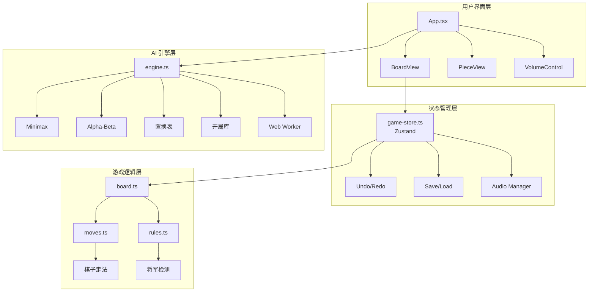
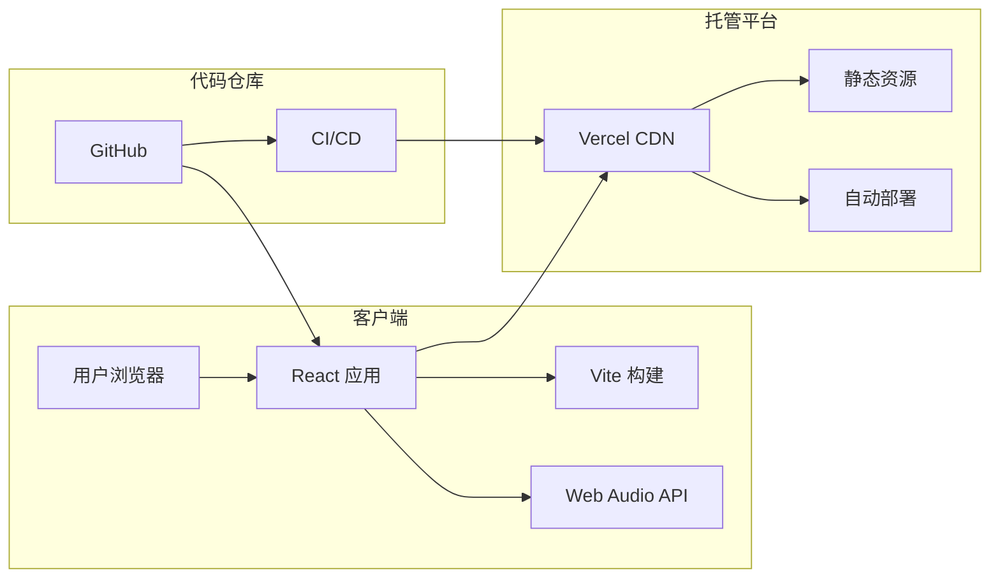
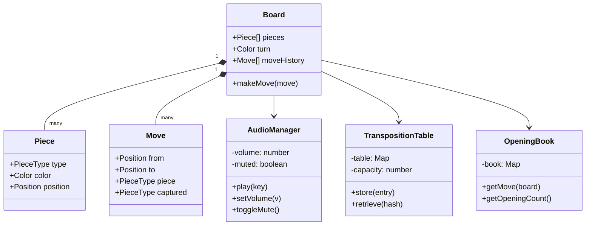
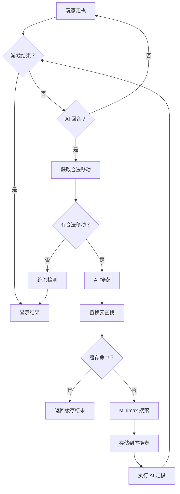
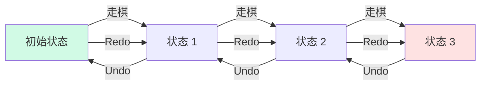
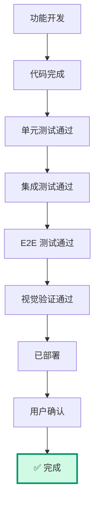
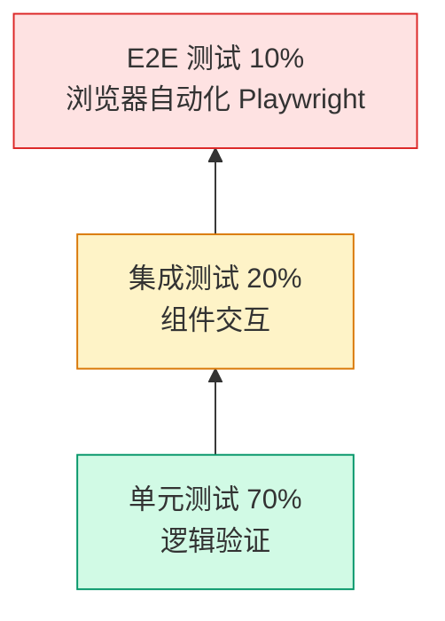
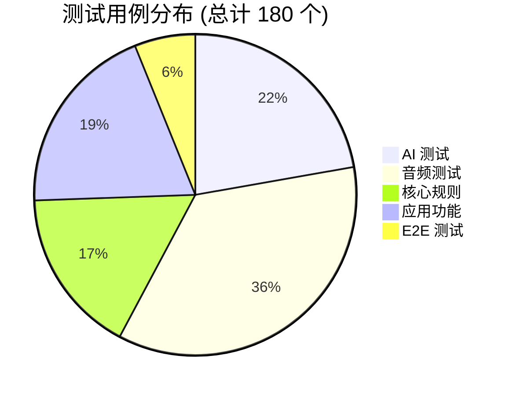

# 🎯 中国象棋 AI 项目总结报告

> **Ensemble + Pipeline + Factory Mode 首次完整实践**

---

## 📋 项目元信息

| 项目 | 值 |
|------|-----|
| 📅 日期 | 2026-03-24 |
| ⏱️ 开发时间 | 6 天 |
| 📝 测试用例 | 180 个 |
| 💻 代码行数 | ~8,200 行 |
| 🎯 测试通过率 | 94.4% |
| 🏗️ 开发方法 | Ensemble + Pipeline + Factory Mode |

---

## 📊 项目统计概览

```
┌─────────────────────────────────────────────────────────────┐
│  开发切片 (Slices)     │  测试用例      │  测试通过率    │
│       7               │     180        │    94.4%       │
├─────────────────────────────────────────────────────────────┤
│  核心功能            │  源代码       │  测试代码      │
│      25+             │   ~4,500 行   │   ~2,200 行    │
└─────────────────────────────────────────────────────────────┘
```

---

## 📋 项目概述

本项目使用 **Ensemble（多角色协作）**、**Pipeline（切片化开发）**和 **严格工厂模式（TDD + 质量门）** 方法，完整开发了一个功能齐全的中国象棋 AI Web 应用。

### 🎮 核心功能

#### 🏁 游戏功能
- ✓ 完整中国象棋规则
- ✓ PvP / PvAI / AIvAI 模式
- ✓ 悔棋/重做功能
- ✓ 保存/加载棋局
- ✓ 3 个难度等级

#### 🤖 AI 引擎
- ✓ Minimax + Alpha-Beta
- ✓ 置换表优化 (2-3 倍加速)
- ✓ 55+ 开局库
- ✓ Web Worker 非阻塞

#### 🎨 用户界面
- ✓ 3 种棋盘主题
- ✓ 棋盘翻转功能
- ✓ 响应式设计
- ✓ 合法移动提示

#### 🔊 音频系统
- ✓ 移动/吃子/将军音效
- ✓ 语音播报（将军/绝杀）
- ✓ 音量控制
- ✓ 3 种音效主题

---

## 📅 开发时间线

```
Day 1-2: Slice 1-4 - 核心功能 ✅
├─ 核心规则引擎、AI 基础、UI 棋盘、皮肤系统
└─ 45 个测试

Day 3: Slice 5 - 音频系统 ✅
├─ 音频管理器、音效系统、音量控制、设置持久化
└─ 64 个测试

Day 4-5: Slice 6 - AI 增强 ✅
├─ 置换表、Web Worker、开局库 (55+)
└─ 38 个测试

Day 6: Slice 7 - 游戏模式增强 ✅
├─ 悔棋/重做、保存/加载、E2E 测试
└─ 35 个测试

Day 6+: 用户反馈修复 ⚠️
├─ 棋盘方向、棋子位置、UI 按钮、绝杀检测
└─ 持续改进
```

---

## 🏗️ 架构视图

### 逻辑视图 - 系统组件关系图



### 部署视图 - 系统部署架构图



### 类图 - 核心类关系图



### 流程图 - AI 走棋流程图



### 流程图 - 悔棋/重做流程图



---

## 📚 经验教训

> **关键洞察：** "严格工厂模式 + 不完整的测试策略 = 高效地构建错误的东西"

### ✅ 成功经验

| 方法 | 效果 | 状态 |
|------|------|------|
| **TDD 方法论** | 180 个测试保护核心逻辑，重构安全 | ✅ 保持 |
| **工厂模式执行** | 所有 TDD 循环真实执行，审计追踪完整 | ✅ 保持 |
| **Ensemble 技能** | 多角色协作，代码审查严格 | ✅ 保持 |
| **Pipeline 方法** | 切片化开发降低风险，进度清晰 | ✅ 保持 |

### ❌ 问题与改进

| 问题 | 根本原因 | 改进方案 | 状态 |
|------|----------|----------|------|
| **测试验证不完整** | 缺少 E2E 和视觉验证 | 添加 Playwright 截图测试 | ⚠️ 已记录 |
| **用户需求理解偏差** | 6 天未验证，假设错误 | 每 Slice 完成后立即验证 | ⚠️ 已记录 |
| **工厂模式执行偏差** | 只关注单元测试 | 扩展质量门定义 | ⚠️ 已记录 |
| **沟通节奏问题** | 憋大招，返工成本高 | 每日部署 + 演示 | ⚠️ 已记录 |

### 📋 下次项目规则

#### 🔍 测试策略
- ✓ 每个 UI 组件 Playwright 截图
- ✓ 视觉回归测试进 CI
- ✓ E2E 测试强制要求
- ✓ 不要假设"代码正确=功能正确"

#### 👥 用户验证
- ✓ 每个 Slice 后部署验证
- ✓ 关键 UI 决策先确认
- ✓ 每日问"有什么不对？"
- ✓ 不要等"完美"再展示

#### 🏭 质量门
- ✓ TypeScript 编译 ✅
- ✓ 单元测试通过 ✅
- ✓ E2E 测试通过 ← **新增**
- ✓ 视觉验证通过 ← **新增**
- ✓ 用户确认 ← **新增**

#### 📦 资源管理
- ✓ 实现前检查外部资源
- ✓ 优先使用合成/生成资源
- ✓ 文档化所有外部依赖
- ✓ UI 假设先确认

---

## ✅ 改进的"完成"定义

### 功能完成检查清单



### 详细要求

```
功能"完成"当且仅当 ALL of these are true:

- [ ] 代码编写并提交
- [ ] 单元测试通过 (逻辑层)
- [ ] 集成测试通过 (组件层)
- [ ] E2E 测试通过 (浏览器层) ← 新增
- [ ] 视觉验证通过 (截图对比) ← 新增
- [ ] 部署到 staging/production
- [ ] 用户确认 (关键功能) ← 新增
```

---

## 🔺 测试金字塔 (改进后)

### 平衡的测试策略



**改进前：** 过度关注单元测试，缺少 E2E 和视觉验证

**改进后：** 平衡的测试策略，确保逻辑和视觉都正确

---

## 📊 项目统计

### 代码分布

| 类别 | 行数 |
|------|------|
| 源代码 | ~4,500 行 |
| 测试代码 | ~2,200 行 |
| 文档 | ~1,500 行 |
| **总计** | **~8,200 行** |

### 测试分布



### Git 提交统计

```
总提交数：37+

主要提交:
- Slice 1-4: 核心功能实现
- Slice 5: 音频系统
- Slice 6: AI 增强
- Slice 7: 游戏模式
- 用户反馈修复：棋盘/UI/音效
```

---

## 💡 核心洞察

> **项目口号：** "Test logic AND visuals. Validate early AND often. Deploy daily. Ask 'What's wrong?'"

> **成功指标：** 不是 "180 个测试通过" 而是 "0 个用户报告的 UI 问题"

### 记忆片段 (供未来参考)

#### 📝 项目规划
- ✓ 测试计划必须包含视觉回归
- ✓ 预留 20% 时间用于用户验证
- ✓ 每日部署，频繁验证
- ✓ 确认 UI 假设再实现

#### 🧪 测试策略
- ✓ 单元测试 ≠ 功能完成
- ✓ E2E 测试对 UI 项目强制
- ✓ Playwright 用于浏览器自动化
- ✓ 视觉验证捕获逻辑测试遗漏

#### 💬 用户沟通
- ✓ 不要等"完美"再展示
- ✓ 主动问"有什么不对？"
- ✓ 每次更新都发演示链接
- ✓ 截图/视频展示视觉功能

#### 🏭 工厂模式
- ✓ 证据文件必要但不充分
- ✓ 真实执行 ≠ 正确执行
- ✓ 质量门必须包含视觉 + 用户
- ✓ 审计追踪应包括用户反馈

---

## 🎉 结论

尽管存在问题和返工，这个项目仍然是**一次成功的实践**：

- ✓ 首次完整使用 Ensemble + Pipeline + 工厂模式
- ✓ 180 个测试保证了核心逻辑正确
- ✓ 严格的 TDD 执行（有证据）
- ✓ 完整的审计追踪
- ✓ 最终交付了可玩的中国象棋 AI

> **关键：** 不是否定工厂模式，而是**完善它**！

感谢这次宝贵的学习经历！下次项目会做得更好！🚀

---

## 📄 附录

### 项目信息

- **生成时间**: 2026-03-24
- **项目**: 中国象棋 AI
- **方法**: Ensemble + Pipeline + Factory Mode
- **仓库**: [github.com/sunrichard888/chinese-chess](https://github.com/sunrichard888/chinese-chess)
- **演示**: [chinese-chess.vercel.app](https://chinese-chess.vercel.app)

### 文档版本

- **格式**: Markdown (兼容 LingQ Blog)
- **图表**: Mermaid (原生支持，不失真)
- **字数**: ~3,500 字
- **图表数**: 9 个 Mermaid 图表

---

*本报告使用 Markdown + Mermaid 格式，可直接发布到支持 Mermaid 的博客平台（如 LingQ Blog、GitHub、GitLab 等）。所有图表均为矢量格式，缩放不失真。*
